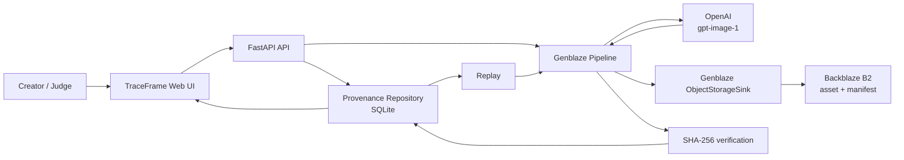

# TraceFrame

**Generate. Prove. Replay.**

TraceFrame is a provenance-first generative media pipeline. It creates images through OpenAI using the official Genblaze provider, stores assets and canonical manifests in Backblaze B2, records hashes and lineage in a queryable history, and can replay any previous run.

Built for the [Backblaze Generative Media Hackathon](https://backblaze-generative-media.devpost.com/).

## Why it exists

Creative teams can generate an asset in seconds, but often cannot answer which prompt, model, parameters, or source produced it. TraceFrame treats provenance as a product feature: every output receives a SHA-256 hash, canonical manifest, durable B2 URL, timestamps, generation parameters, and an optional parent run.

## Features

- OpenAI image generation orchestrated by Genblaze
- Backblaze B2 storage through Genblaze's first-class S3 sink
- SHA-256 asset and canonical manifest verification
- SQLite provenance index with prompt, parameters, timestamps, status, and lineage
- Replay with the original prompt or an override
- REST API with OpenAPI docs
- Responsive interactive web UI
- Credential-free demo mode
- Docker, GitHub Actions, tests, sample data, and demo scripts

## Architecture



The API keeps credentials server-side. Genblaze handles provider orchestration, asset transfer, manifest creation, hashing, and B2 key layout. TraceFrame adds a durable, queryable application index and lineage-aware replay.

## Quick start with Docker

1. Copy the environment template:

   ```bash
   cp .env.example .env
   ```

2. Add `OPENAI_API_KEY`, `B2_KEY_ID`, `B2_APP_KEY`, `B2_BUCKET`, and the bucket's `B2_REGION`.

3. Start both services:

   ```bash
   docker compose up --build
   ```

4. Open:

   - Web UI: `http://localhost:3000`
   - API docs: `http://localhost:8000/docs`
   - Health: `http://localhost:8000/health`

Set `DEMO_MODE=true` to run end-to-end without external API calls. Demo artifacts are written under `data/artifacts`; live mode stores generated media and manifests in B2.

## Local development

Requires Python 3.11+ and Node.js 22+.

```bash
python -m venv .venv
source .venv/bin/activate
pip install -r requirements.txt
cp .env.example .env
PYTHONPATH=backend uvicorn app.main:app --reload
```

In a second terminal:

```bash
npm ci
npm run dev
```

On PowerShell, activate with `.venv\Scripts\Activate.ps1`, set `$env:PYTHONPATH="backend"`, and use `.\scripts\demo.ps1` for the demo.

## API

| Method | Endpoint | Purpose |
|---|---|---|
| `GET` | `/health` | Readiness and active storage mode |
| `POST` | `/api/generations` | Generate and persist an image |
| `GET` | `/api/generations` | List provenance history |
| `GET` | `/api/generations/{id}` | Inspect one run |
| `POST` | `/api/generations/{id}/replay` | Replay a run, optionally overriding its prompt |
| `GET` | `/manifests/{id}.json` | Read a local demo manifest |

Example:

```bash
curl -X POST http://localhost:8000/api/generations \
  -H "Content-Type: application/json" \
  -d '{"prompt":"A refillable trail bottle on warm stone at sunrise"}'
```

## Demo

With the stack running:

```bash
./scripts/demo.sh
```

The script checks health, creates an image, replays it, and prints the resulting provenance history. `sample_data/generation.json` contains a submission-ready example record.

### Three-minute demo outline

1. **0:00–0:30 — Problem:** generated media loses its origin and becomes difficult to audit or reproduce.
2. **0:30–1:15 — Generate:** enter a campaign prompt and show the Genblaze event pipeline.
3. **1:15–2:00 — Prove:** open the B2 asset and manifest; compare asset and canonical SHA-256 hashes.
4. **2:00–2:35 — Replay:** replay the original generation and show `parent_id` lineage.
5. **2:35–3:00 — Production path:** show Docker deployment, API docs, retry-ready Genblaze adapters, and durable B2 layout.

## Production notes

- Use a bucket-scoped B2 application key with only the capabilities needed for the target bucket.
- Mount `/app/data` on durable storage or replace the repository with Postgres for multiple API replicas.
- Put the API behind TLS and an identity-aware proxy before supporting multiple tenants.
- Pin image models through `OPENAI_IMAGE_MODEL`; captured model IDs make runs reproducible.
- B2 URLs may be public or signed depending on bucket/backend configuration.
- Never expose provider or B2 keys to the browser.

## Testing

```bash
PYTHONPATH=backend pytest backend/tests -q
npm run build
docker build -t traceframe-api .
docker build -f Dockerfile.web -t traceframe-web .
```

CI runs the same checks on every push and pull request.

## License

[MIT](LICENSE)
